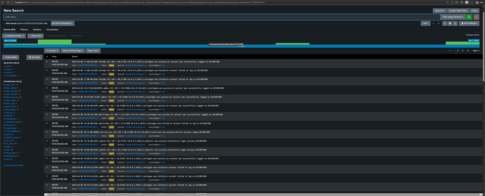
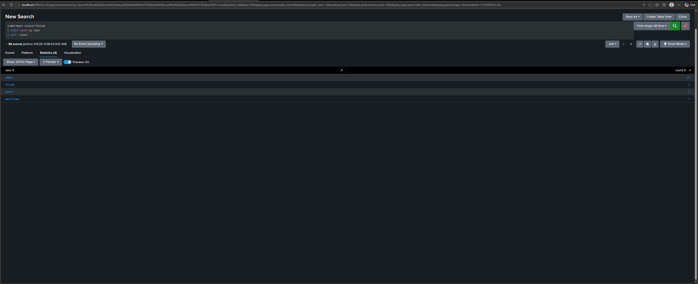
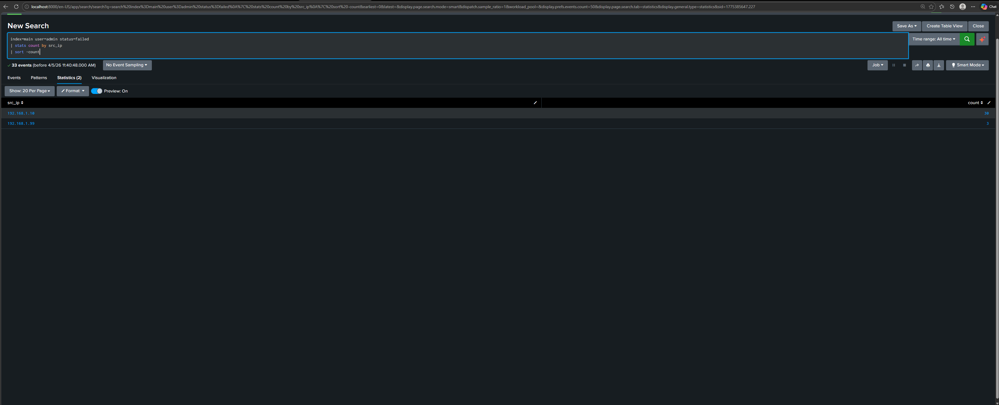
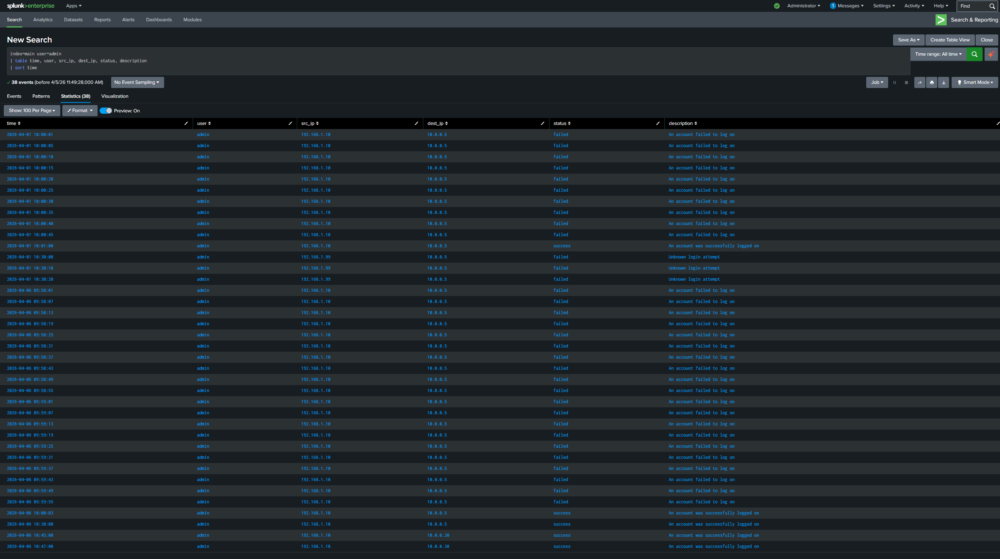
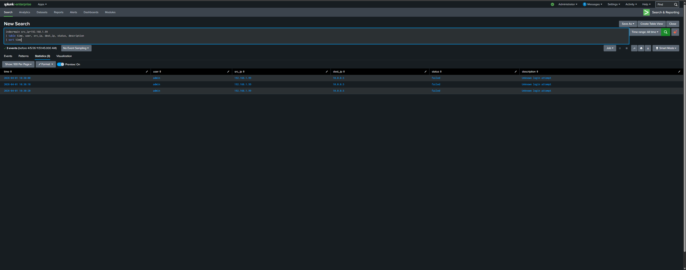
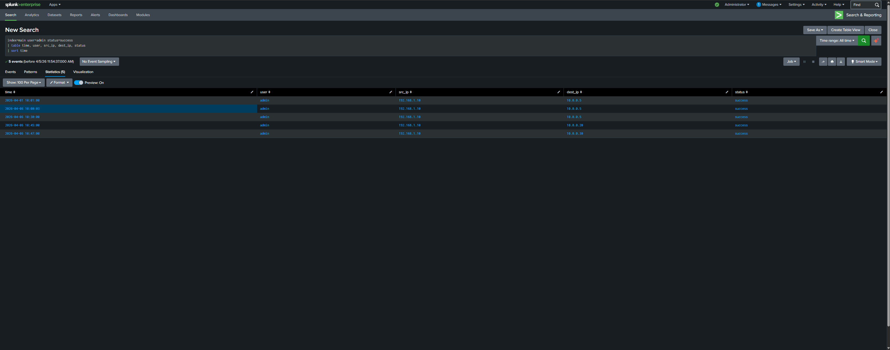

## Scenario
It is Monday morning at SecureCore Ltd. The SOC team receives an alert indicating 
multiple failed login attempts on the domain controller. A junior analyst is tasked 
with investigating whether this is a user who forgot their password or an active 
attack against the network.

## Objective
Investigate suspicious authentication activity using Splunk, identify the attacking 
source, determine whether the attack succeeded, and trace any post-breach activity 
across the network.

## Tools Used
- Splunk Enterprise
- SPL (Search Processing Language)

## Dataset
- File: brute-force-logs.csv
- Index: main
- Total Events: 124
- Log Fields: time, host, user, src_ip, dest_ip, EventCode, LogonType, 
  ProcessName, status, description, domain

---

## Investigation Steps

### Step 1 — Load and Review Raw Logs
The dataset was loaded into Splunk and raw logs were reviewed to understand 
the scope of activity.

**Query used:**
index=main

**Finding:**
124 total events were present across multiple users and IP addresses. 
Initial review revealed a high volume of failed login attempts concentrated 
on a single user account.

---

### Step 2 — Identify the Most Targeted Account
Failed logins were grouped by user to identify which account was being 
targeted the most.

**Query used:**
index=main status=failed
| stats count by user
| sort -count

**Finding:**
| User | Failed Attempts |
|------|----------------|
| admin | 33 |
| tbrady | 2 |
| user2 | 2 |
| mwilliams | 1 |

The admin account had 33 failed attempts — significantly higher than all 
other users combined. This immediately indicated the admin account was the 
primary target.

---

### Step 3 — Identify the Attacking IP Address
Failed login attempts against the admin account were filtered and grouped 
by source IP to identify the attacker.

**Query used:**
index=main user=admin status=failed
| stats count by src_ip
| sort -count

**Finding:**
| Source IP | Failed Attempts |
|-----------|----------------|
| 192.168.1.10 | 30 |
| 192.168.1.99 | 3 |

Two suspicious IP addresses were identified targeting the admin account. 
192.168.1.10 was the primary attacker with 30 failed attempts. 
192.168.1.99 appeared separately with 3 unknown login attempts.

---

### Step 4 — Reconstruct the Full Attack Timeline
All admin account activity was retrieved and sorted chronologically to 
reconstruct the complete attack timeline.

**Query used:**
index=main user=admin
| table time, user, src_ip, dest_ip, status, description
| sort time

**Finding:**

**Phase 1 — Initial Brute Force (April 1st, 10:00 AM)**
- 192.168.1.10 began hammering the admin account with repeated failed 
  attempts every 4-6 seconds
- After 10 consecutive failures, the attacker successfully authenticated 
  at 10:01:00
- The attack lasted approximately 60 seconds from first attempt to breach

**Phase 2 — Second Actor (April 1st, 10:30 AM)**
- 192.168.1.99 appeared 29 minutes after the initial breach
- Made exactly 3 attempts described as "Unknown login attempt"
- Did not succeed and stopped after 20 seconds
- Timing suggests possible coordination with the primary attacker

**Phase 3 — Return Attack (April 6th, 09:58 AM)**
- 192.168.1.10 returned 5 days later
- Launched another wave of brute force attempts
- Successfully breached the admin account again at 10:00:03

---

### Step 5 — Investigate the Second IP Address
The second IP address was investigated separately to understand its 
behaviour and possible relationship to the primary attacker.

**Query used:**
index=main src_ip=192.168.1.99
| table time, user, src_ip, dest_ip, status, description
| sort time

**Finding:**
192.168.1.99 made exactly 3 failed attempts against the admin account 
within a 20 second window. The description "Unknown login attempt" 
differs from the standard failed login message generated by 192.168.1.10, 
suggesting a different tool or method was used. The appearance of this IP 
29 minutes after the initial breach raises the possibility of credential 
sharing between two attackers.

---

### Step 6 — Trace Lateral Movement
Successful admin logins were isolated and sorted by time to identify 
whether the attacker moved across the network after the initial breach.

**Query used:**
index=main user=admin status=success
| table time, user, src_ip, dest_ip, status
| sort time

**Finding:**
After breaching the admin account, the attacker did not stay on one server. 
They moved laterally across the network accessing multiple systems:

| Time | Destination Server |
|------|--------------------|
| 2026-04-06 10:00:03 | 10.0.0.5 — Domain Controller |
| 2026-04-06 10:30:00 | 10.0.0.5 — Domain Controller |
| 2026-04-06 10:45:00 | 10.0.0.20 — File Server |
| 2026-04-06 10:47:00 | 10.0.0.30 — Backup Server |

Access to the backup server is particularly critical as attackers commonly 
target backups to prevent recovery after a ransomware attack.

---

## Findings Summary

| Finding | Detail |
|---------|--------|
| Targeted account | admin |
| Primary attacking IP | 192.168.1.10 |
| Secondary suspicious IP | 192.168.1.99 |
| Total failed attempts | 33 |
| Total successful breaches | 5 |
| First breach | 2026-04-01 10:01:00 |
| Attack returned | 2026-04-06 09:58:01 |
| Servers accessed | 10.0.0.5, 10.0.0.20, 10.0.0.30 |
| Attack type | Brute force with lateral movement |

---

## Conclusion
This investigation confirmed a successful brute force attack against the 
admin account at SecureCore Ltd. The attacker at 192.168.1.10 conducted 
repeated authentication attempts over two separate dates, successfully 
breaching the account on both occasions. Following the breach, the attacker 
moved laterally across the network accessing the domain controller, file 
server, and critically the backup server.

The appearance of a second IP address 192.168.1.99 with unusual login 
attempt descriptions suggests this may have been a coordinated attack 
involving more than one actor.

## Recommended Actions
- Immediately disable or reset the admin account credentials
- Block 192.168.1.10 and 192.168.1.99 at the firewall
- Investigate all activity on 10.0.0.20 and 10.0.0.30 for signs of 
  data theft or tampering
- Implement account lockout policy after 5 failed attempts
- Enable multi-factor authentication on all privileged accounts
- Review backup server integrity immediately
