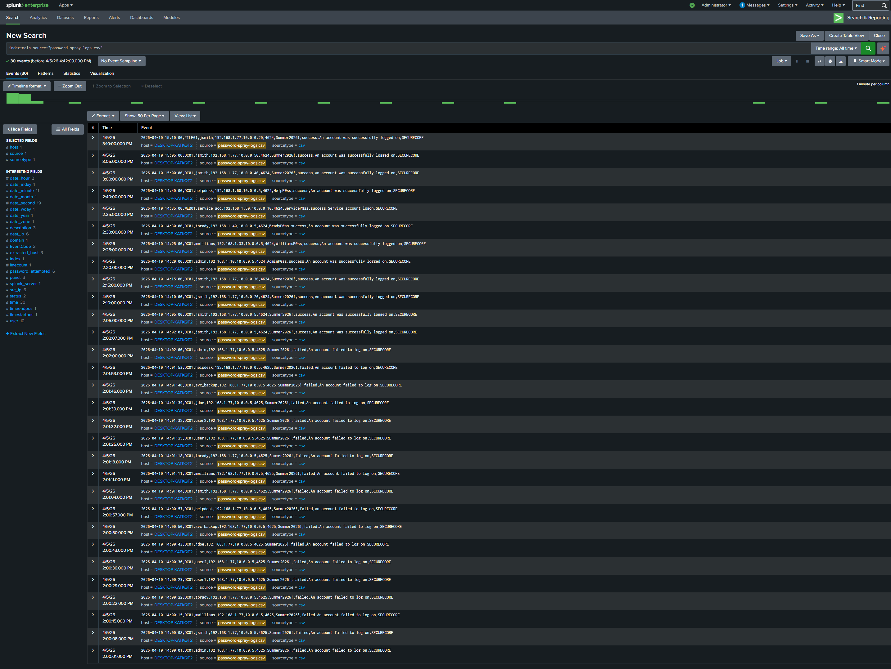
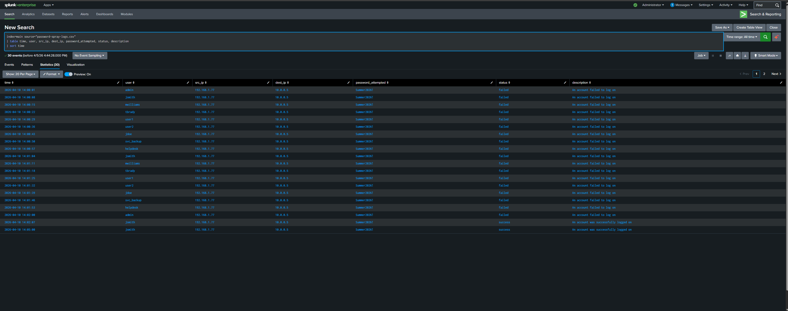
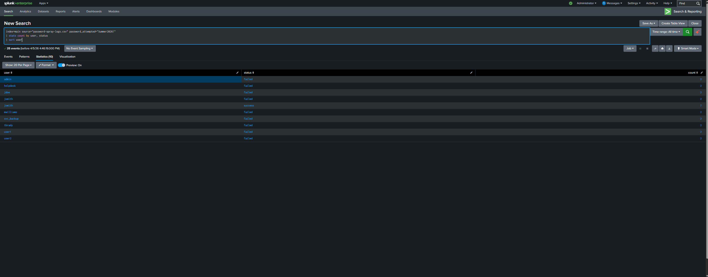
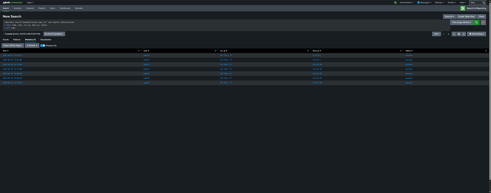
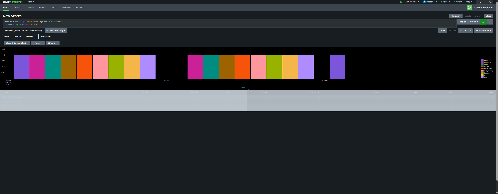

## Scenario
It is Friday afternoon at SecureCore Ltd. The SOC dashboard shows an unusual 
pattern — failed login attempts are appearing across 8 different user accounts 
almost simultaneously. Unlike a normal brute force attack, no single account 
has enough failures to trigger an account lockout alert. A SOC analyst is 
tasked with investigating whether this is a coordinated attack or a system 
malfunction.

## Objective
Investigate suspicious authentication activity using Splunk, identify the 
attack pattern, determine which account was compromised, trace post-breach 
lateral movement, and document all findings professionally.

## Tools Used
- Splunk Enterprise
- SPL (Search Processing Language)

## Dataset
- File: password-spray-logs.csv
- Index: main
- Total Events: 30
- Log Fields: time, host, user, src_ip, dest_ip, EventCode, 
  password_attempted, status, description, domain

---

## Background — Brute Force vs Password Spraying

Understanding the difference between these two attacks is critical for 
detection:

| | Brute Force | Password Spraying |
|--|-------------|-------------------|
| **Approach** | Many passwords against one account | One password against many accounts |
| **Speed** | Fast and aggressive | Slow and deliberate |
| **Detection** | Easy — one account spikes | Hard — spread across accounts |
| **Lockout risk** | High — triggers lockout quickly | Low — stays under lockout threshold |

Password spraying is significantly harder to detect because no single account 
accumulates enough failures to trigger standard security alerts. Attackers 
deliberately use this technique to blend in with normal failed login noise.

---

## Investigation Steps

### Step 1 — Load and Review Raw Logs
The dataset was loaded into Splunk and raw logs were reviewed to understand 
the full scope of authentication activity.

**Query used:**
index=main source="password-spray-logs.csv"

**Finding:**
30 total authentication events were present. Initial review of the 
password_attempted field immediately revealed that one password — 
Summer2026! — appeared in 83.3% of all events, a strong early indicator 
of password spraying activity.

---

### Step 2 — Full Dataset Overview
All events were organised into a clean table to get a complete picture of 
authentication activity across the environment.

**Query used:**
index=main source="password-spray-logs.csv"
| table time, user, src_ip, dest_ip, password_attempted, status, description
| sort time

**Finding:**
The table clearly showed the spray pattern — the same source IP 192.168.1.77 
attempting authentication against multiple different user accounts within 
seconds of each other. All legitimate user logins came from their own 
individual IP addresses while all suspicious activity originated from 
192.168.1.77.

---

### Step 3 — Identify the Spray Pattern and Compromised Account
All events using the spray password were isolated and grouped by user and 
status to identify the compromised account.

**Query used:**
index=main source="password-spray-logs.csv" password_attempted="Summer2026!"
| stats count by user, status
| sort user

**Finding:**
| User | Status | Count |
|------|--------|-------|
| admin | failed | 2 |
| helpdesk | failed | 2 |
| jdoe | failed | 2 |
| jsmith | success | 7 |
| mwilliams | failed | 2 |
| svc_backup | failed | 2 |
| tbrady | failed | 2 |
| user1 | failed | 2 |
| user2 | failed | 2 |

Every account received exactly 2 failed attempts — deliberately staying 
under the account lockout threshold. The attacker correctly guessed that 
jsmith used Summer2026! as their actual password, resulting in 7 successful 
authentications using jsmith's compromised credentials.

---

### Step 4 — Confirm Single Source IP
Failed login attempts were grouped by source IP to confirm the attack 
originated from a single location.

**Query used:**
index=main source="password-spray-logs.csv" status=failed
| stats count by src_ip
| sort -count

**Finding:**
All 18 failed login attempts across 9 different user accounts originated 
exclusively from IP address 192.168.1.77. A single IP targeting multiple 
accounts simultaneously is a definitive indicator of an automated password 
spray tool rather than random user mistakes.

---

### Step 5 — Trace Lateral Movement
Successful logins using jsmith's compromised credentials were isolated and 
sorted chronologically to trace the attacker's movement across the network.

**Query used:**
index=main source="password-spray-logs.csv" user=jsmith status=success
| table time, user, src_ip, dest_ip, status
| sort time

**Finding:**
After compromising jsmith's account at 14:02:07, the attacker moved 
laterally across the network accessing 5 different servers within one hour:

| Time | Destination | Significance |
|------|-------------|-------------|
| 14:02:07 | 10.0.0.5 | Domain Controller — most critical server |
| 14:05:00 | 10.0.0.5 | Domain Controller accessed again |
| 14:10:00 | 10.0.0.20 | File Server — potential data theft |
| 14:15:00 | 10.0.0.30 | Backup Server — critical risk |
| 15:00:00 | 10.0.0.40 | Unknown server |
| 15:05:00 | 10.0.0.50 | Unknown server |
| 15:10:00 | 10.0.0.20 | Returns to File Server |

Access to the domain controller and backup server represents a critical 
severity finding. The attacker could potentially reset passwords, create 
new accounts, steal files, and destroy backups to prevent recovery.

---

### Step 6 — Visualize the Spray Pattern Over Time
A timechart was used to visualize failed login activity over time, 
providing clear visual proof of the synchronized spray pattern.

**Query used:**
index=main source="password-spray-logs.csv" status=failed
| timechart span=1m count by user

**Finding:**
The visualization clearly showed three synchronized waves of failed login 
attempts at 14:00, 14:01 and 14:02 — every user account being hit 
simultaneously in each wave. This synchronized pattern is only possible 
with an automated attack tool and is impossible to explain as random user 
mistakes. Normal failed login patterns appear scattered and random — never 
synchronized across all accounts simultaneously.

---

## Findings Summary

| Finding | Detail |
|---------|--------|
| Attack type | Password spraying |
| Attacking IP | 192.168.1.77 |
| Accounts targeted | 9 accounts |
| Total failed attempts | 18 |
| Attempts per account | 2 — deliberately under lockout threshold |
| Compromised account | jsmith |
| Compromise time | 2026-04-10 14:02:07 |
| Servers accessed | 10.0.0.5, 10.0.0.20, 10.0.0.30, 10.0.0.40, 10.0.0.50 |
| Attack duration | Spray lasted 2 minutes, lateral movement lasted 1 hour |
| Root cause | Weak seasonal password — Summer2026! |

---

## MITRE ATT&CK Mapping

| Technique | ID | What was observed |
|-----------|-----|------------------|
| Password Spraying | T1110.003 | Single password attempted against multiple accounts |
| Valid Accounts | T1078 | Compromised jsmith credentials used for access |
| Lateral Movement | T1021 | Attacker moved across 5 servers using stolen credentials |
| Remote Services | T1021.002 | Network logons used to access remote servers |

---

## Conclusion
This investigation confirmed a successful password spray attack against 
SecureCore Ltd. The attacker at IP 192.168.1.77 used an automated tool 
to attempt the password Summer2026! against 9 user accounts in 
synchronized waves — deliberately staying under the account lockout 
threshold to avoid detection.

The attack succeeded because jsmith used a weak seasonal password that 
matched the attacker's guess. Following the breach, the attacker moved 
laterally across 5 servers including the domain controller and backup 
server — representing a critical severity incident with potential for 
complete network compromise, data theft, and ransomware deployment.

The synchronized timing pattern visible in the timechart visualization 
is definitive proof of automated password spraying activity and could 
not be explained by normal user behaviour.

## Recommended Actions
- Immediately disable jsmith's account and reset credentials
- Block 192.168.1.77 at the firewall
- Investigate all 5 servers accessed for signs of data theft or tampering
- Force organisation-wide password reset
- Implement and enforce password complexity policy — ban seasonal passwords
- Enable multi-factor authentication on all accounts
- Set account lockout policy to trigger after 3 failed attempts
- Create SIEM alert for single IP targeting more than 3 accounts within 
  60 seconds
- Review all accounts for unauthorised changes made using jsmith credentials
- Check domain controller logs for new account creation or permission changes
